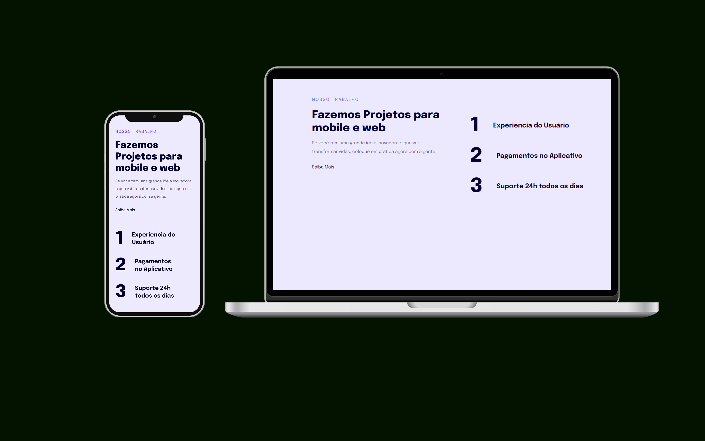

<h1 align="center">Introdução a responsividade</h1>

  

  

## 💻 Projeto

O "introdução a Responsividade" é um projeto com objetivo de treinamento da Responsividade de Sites do Curso Rocketseat.

- [Acesse o projeto](https://explorer-projeto4.vercel.app/)

## 🚀 Tecnologias

Esse projeto foi desenvolvido com as seguintes tecnologias:

- HTML e CSS
- Git e Github
- Figma
